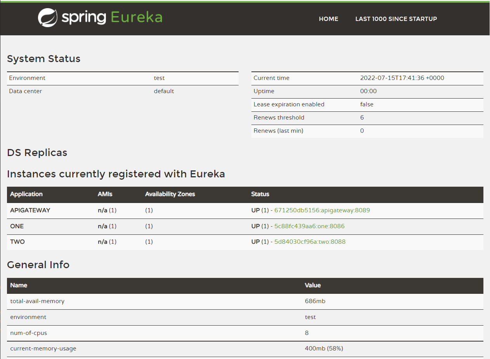

# Microservices
### Tools
Before proceeding, install: 
- [JDK](https://docs.oracle.com/javase/8/docs/technotes/guides/install/install_overview.html) (must be Java 8) and [Apache Maven](https://maven.apache.org/).
- [Apache Maven 3.8.6](https://maven.apache.org/download.cgi)
- [Docker 8.x+](https://docs.docker.com/desktop/windows/install/)
- [Docker Compose 12.x+](https://docs.docker.com/desktop/windows/install/)

### Run application
- Run Docker Desktop
- Open terminal in root folder and enter `docker-compose build` to build docker images
- Open terminal in root folder and enter `docker-compose up`. It takes a few minutes to run all services.
- Go to `http://localhost:8761/` and check `Instances currently registered with Eureka` field. Example of page 
- to stop the application enter `docker-compose down`
